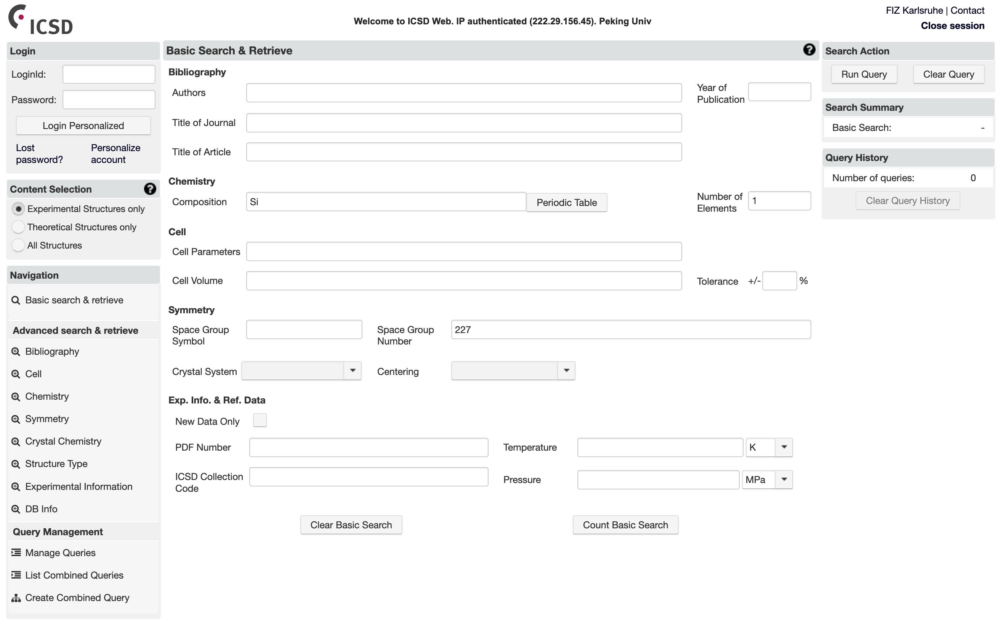

# 获取晶体结构数据

## Inorganic Crystal Structure Database (ICSD)

无机晶体结构数据库[Inorganic Crystal Structure Database](https://icsd.fiz-karlsruhe.de/)是一个大型数据库, 包含了大量的实验上获取的晶体结构数据.

## Materials Project

[Materials Project](https://materialsproject.org/)是基于`pymatgen`的材料基因组项目.

## AFLOW

[AFLOW](http://aflowlib.org/)是Duke大学主持的材料基因组项目.

