# 登入Linux

## 计算机通信协议

- 安全Shell协议(SSH)
- 远程桌面类型(VNC, RDP)
- 文件传输协议(FTP)

## 基于SSH协议的SSH客户端

基本需求

1. 通过命令行的方式操作远端的电脑(投任务, 编辑文本, 编译程序, …)
2. 上传下载文件
3. 支持Linux上的窗口化的程序(比如 [xmgrace](http://plasma-gate.weizmann.ac.il/Grace/))

## 微软Windows下的SSH客户端

1. 自带的ssh客户端工具

    优点: Windows10原生程序, 不需要第三方的程序

    缺点: 文件互传不便, 默认不支持Linux上窗口化程序

2. 第三方ssh客户端, 例如[MobaXterm](https://mobaxterm.mobatek.net/)

    

    优点: 免费软件, 拖拽式文件上传下载, 支持X Windows窗口软件

    缺点: 并不是总能跟上Windows的更新频率

## 自带SSH客户端 {.allowframebreaks}

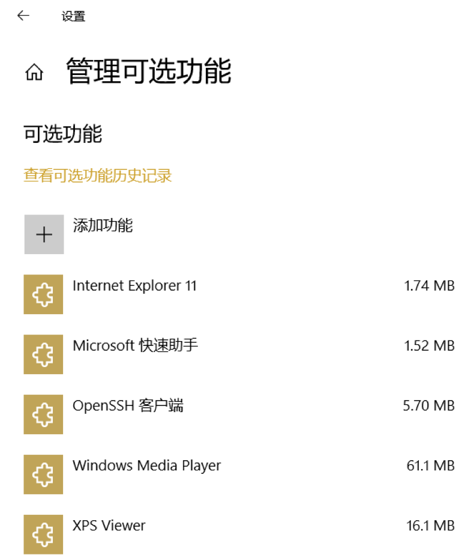{ width=50% }

\framebreak

打开Windows的命令提示符窗口: `Win+R` $\to$ `cmd`

::::::{.columns}
:::{.column width=35%}
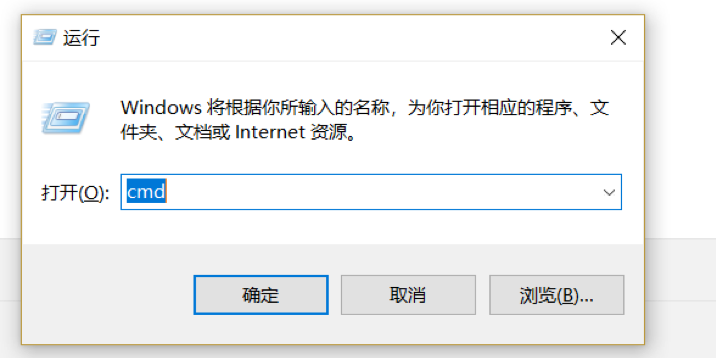
:::
:::{.column width=65%}
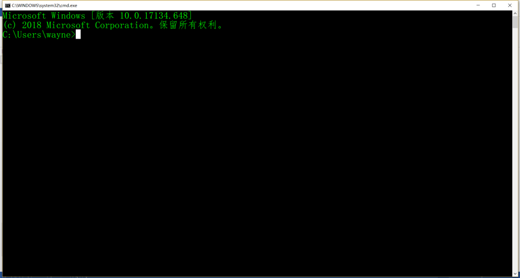
:::
::::::

\framebreak

1. 输入ssh登录的命令

    `@`前面是用户名, `@`后面是远端服务器的IP

2. 输入密码

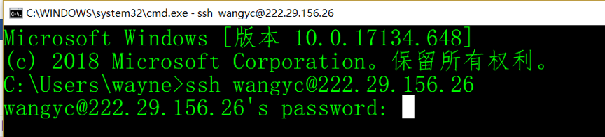

\framebreak

登录成功! 可以在命令行下控制远端设备了

\centering
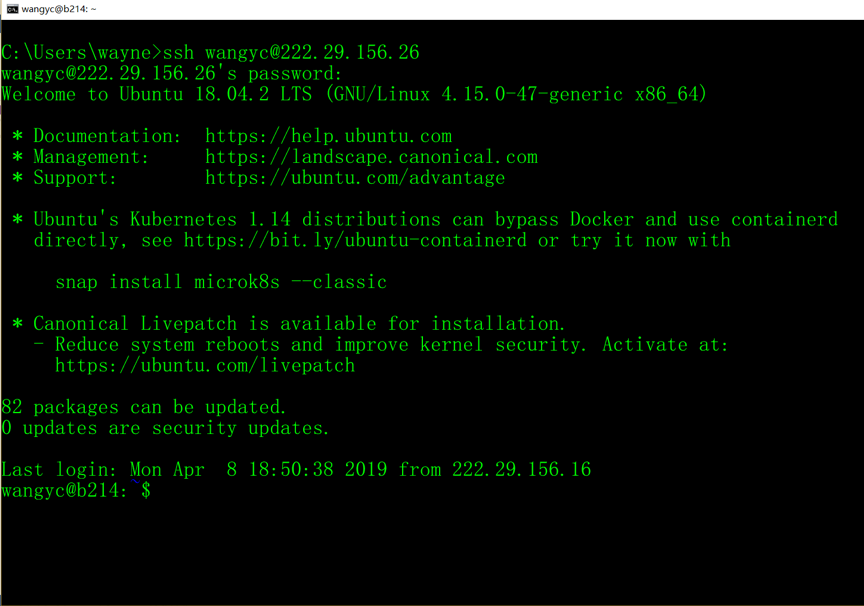{ width=80% }

\framebreak

\raggedright
传输文件: 使用`scp`命令

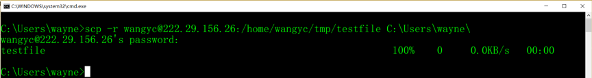

含义:

\qquad 将用户wangyc在

\qquad\qquad 222.29.156.26机器上的`/home/wangyc/tmp/testfile`文件

\qquad 拷贝到`C:\Users\wayne\`目录下

\framebreak

*免密码登录*: 使用`ssh-keygen`命令

一路回车下去, 创建公钥和私钥

在远端服务器上已进行相同的操作, 产生`~/.ssh/`目录

\centering
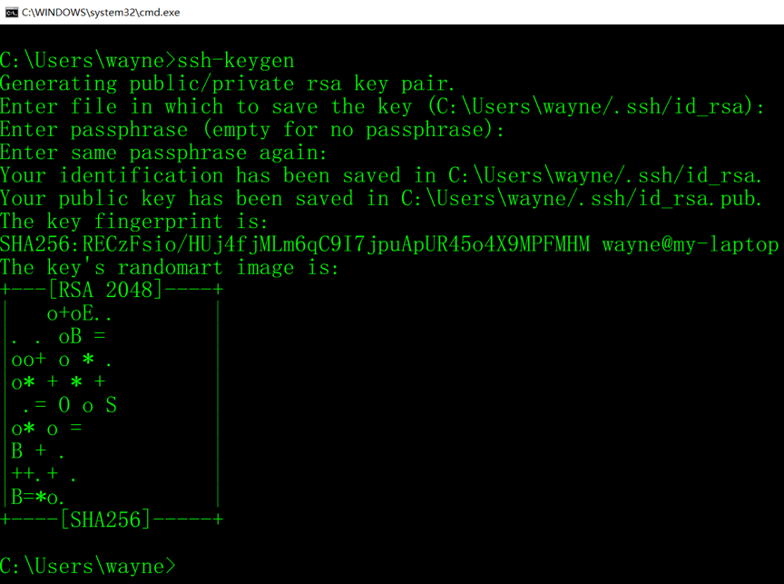{ width=60% }

\framebreak

\raggedright
将`.ssh`目录下的`id_rsa.pub`上传到远端服务器

\centering
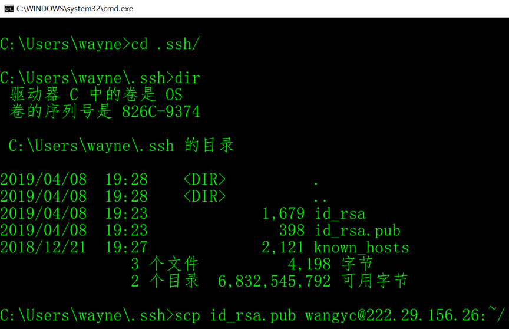{ width=80% }

\framebreak

\raggedright
登录远端服务器(仍要输入密码), 执行

\centering
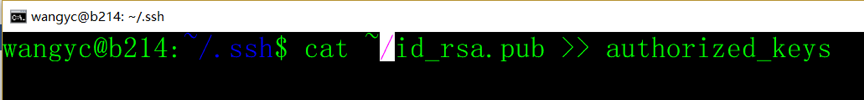{ width=80% }

\raggedright
之后即可无密码访问远端服务器

## MobaXterm {.allowframebreaks}

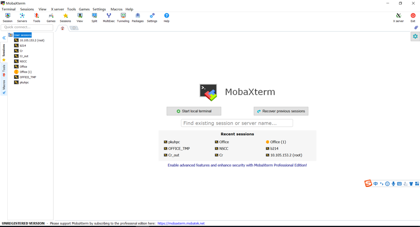

\framebreak

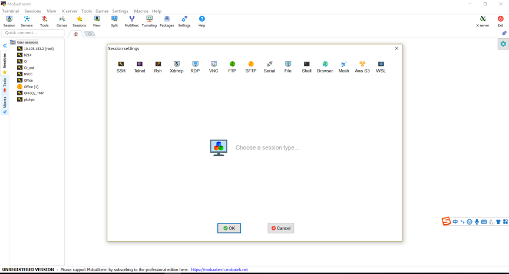

\framebreak

选择中间对话框左上角的SSH标签, 填好远端的IP和用户名, 点击OK, 第一次登陆会询问是否记住密码, 选择记住之后登陆就不用输入密码了

\centering
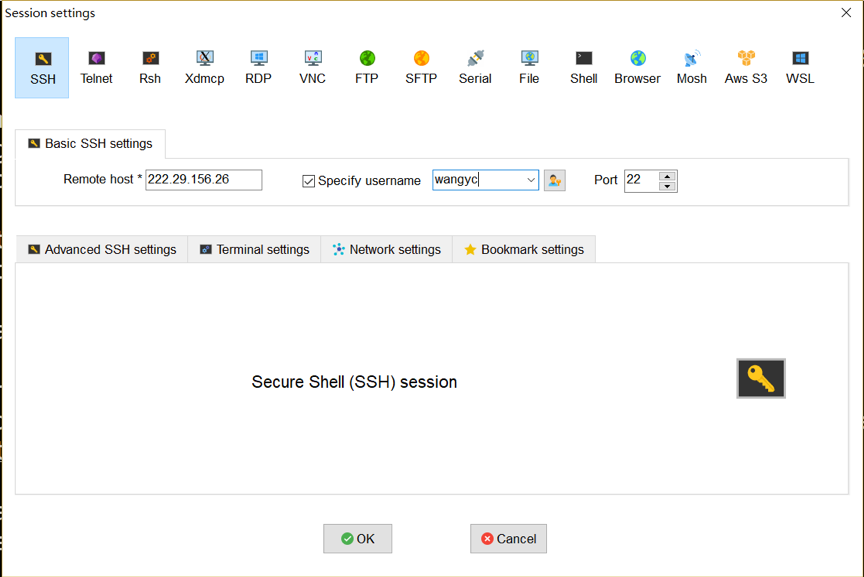{ width=80% }

\framebreak

\raggedright

::::::{.columns}
:::{.column width=60%}
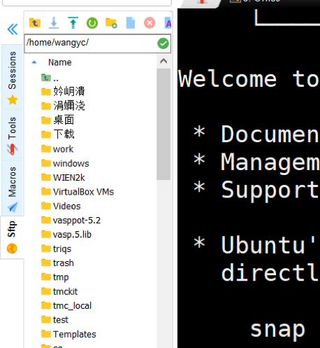
:::
:::{.column width=40%}
\begin{minipage}[c][.6\textheight][c]{\linewidth}
登陆之后左侧出现文件列表

可以通过拖拽的方式进行文件的上传和下载
\end{minipage}
:::
::::::

## 常用计算平台

| 平台                                           | IP              | 备注                                                   |
| :--------------------------------------------- | :-------------- | :----------------------------------------------------- |
| [未名一号](http://hpc.pku.edu.cn/guide_3.html) | 162.105.133.134 | 用户名与密码为一卡通                                   |
| [教学一号](http://hpc.pku.edu.cn/guide_3.html) | 162.105.133.209 | 用户名与密码为一卡通                                   |
|                                                |                 | [自助开通](http://hpc.pku.edu.cn/apply_edu_login.html) |
| [天津中心](http://hpc.nscc-tj.cn)              | 192.168.2.101   | 需VPN                                                  |
| 组内服务器                                     | TBA             | 小型工作站                                             |

临时平台: `dft003@222.29.156.125`

# 编辑文件

## Linux下常用文本编辑器: Vim

- 语法高亮
- 简单的自动补全
- 列编辑和多文件编辑
- 通过键盘输入命令实现, 同时支持鼠标操作

## 学习Vim

- **善用搜索引擎** (百度, Google, ...)

    想知道`vim`如何查找替换 $\Rightarrow$ 搜"vim查找替换"

- Linux下各种命令与程序的用法: CSDN博客, 脚本之家

## 启动, 保存与退出 {.allowframebreaks}

命令行输入`vim`, 回车, 会出现vim的一个界面

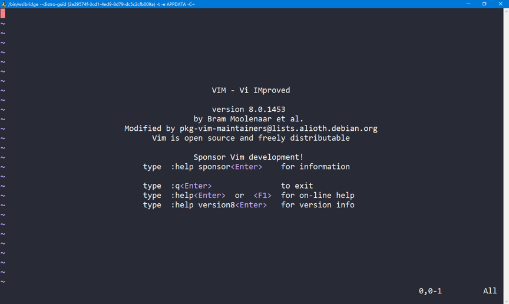{ width=70% }

如果后面加上文件名就会打开相应的文件, 若该文件不存在则创建一个新文件

\framebreak

此时你在键盘上的任何输入一般都是无效的

\centering
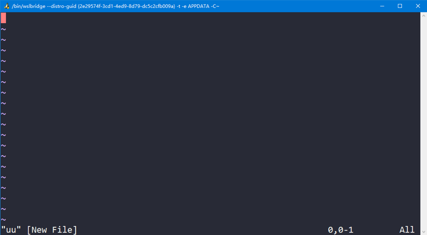{ width=90% }

\framebreak

\raggedright
需要按一下`i`键变成可输入状态, 然后向里面输入内容

\centering
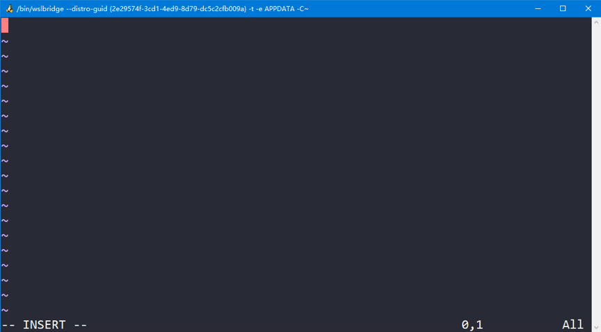{ width=90% }

\framebreak

\raggedright

- `vim`的很多操作是通过"命令"进行的
- 在`--INSERT--`状态下, 任何键盘输入都成为了输入的内容

\framebreak

按一下`Esc`键, 从`--INSERT--`状态下退出

\centering
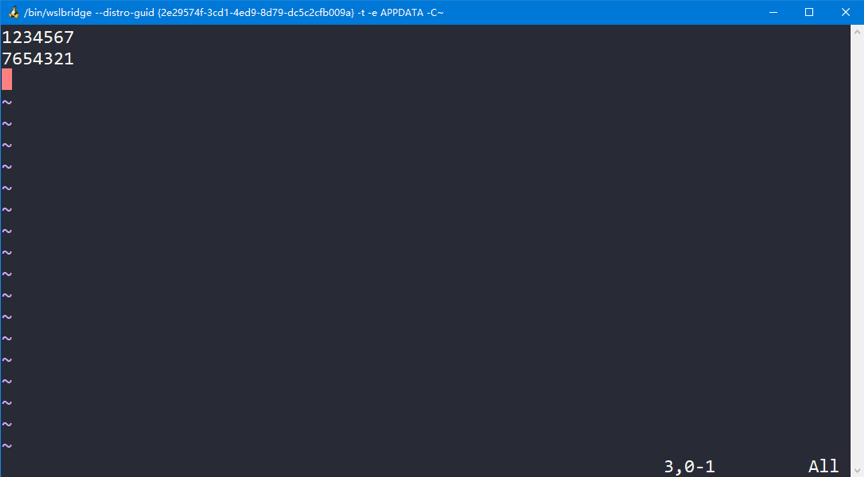{ width=90% }

\framebreak

\raggedright
输入命令

- `:wq`(write and quit), 回车 $\Rightarrow$ 保存并退出
- `:q!`, 回车 $\Rightarrow$ 直接退出, 不保存

**注意**: 两个命令都以一个冒号开头

## 复制, 粘贴和删除文本

| 命令 | 作用                                 |
| :--- | :----------------------------------- |
| `yy` | 复制当前一整行的内容                 |
| `p`  | 把复制的内容粘贴到光标所在行的下一行 |
| `dd` | 删除光标所在的一整行内               |
| `u`  | 撤销上次输入                         |
| `.`  | 恢复上次输入                         |

Table:  Vim常用命令

- Vim不支持鼠标光标选中后Delete
- 注意上面这些都是按了Esc之后执行, 不需要加冒号, 在`--INSERT--`状态无法执行

## 文本定位, 查找和替换 {.allowframebreaks}

跳转

- `Shift + G`跳转到文件末尾
- 按两次`[`可以跳转到文件开头
- `:n`跳转到某一行使用命令, `n`是一个行号
- 使用命令`:set nu`显示行号

\framebreak

查找文本

- 以`FORCE`为例, 在非插入状态下输入`/FORCE`, 光标即可跳转到`FORCE`所在的位置
- 按一下`n`键(next)跳转到下一个`FORCE`文本所在的位置
- 要想从文件末尾查找, 则先按下`Shift + G`跳转到文件末尾, 然后按`Shift + N`, 即可跳转到从末尾数的第一个FORCE所在位置

\framebreak

替换: 与sed命令类似

- 在非插入状态下输入命令`:%s/FORCE/force/g`, 把所有`FORCE`替换成`force`
- 如果没有前面的百分号, 则每次只替换一个

## 列编辑 {.allowframebreaks}

非插入状态下按下`Ctrl + V`即进入列选择状态

按住方向键上下左右即可按列选择文本

按一下`d`键则删除按列选中的文本

::::::{.columns}
:::{.column}
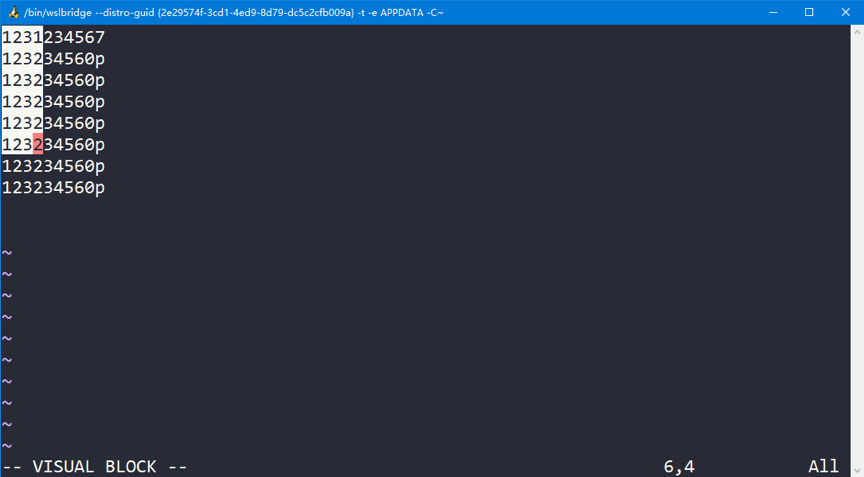
:::
:::{.column}
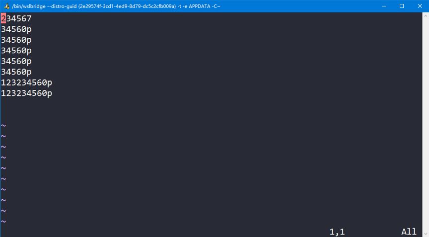
:::
::::::

\framebreak

另一个常用的操作是给很多行加注释

按Esc键进入非插入状态, 按`Ctrl + V`进入列选择状态, 然后选择要插入的列范围

\centering
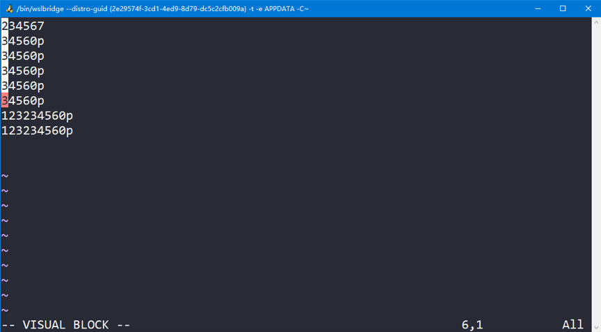{ width=90% }

\framebreak

\raggedright

按下`Shift + i`键, 输入文本

\centering
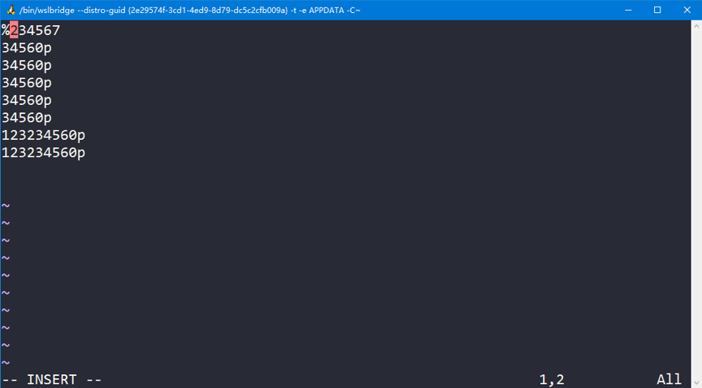{ width=90% }

\raggedright
再连按两次`Esc`, 前面选择过的行前都出现了相同的内容

## 创建INCAR

用`vim`新建名为`INCAR`的文件, 并输入下面的内容

```bash
System = Silicon
GGA = PE
ENCUT = 250
PREC = Normal
ISMEAR = -5
SIGMA = 0.1
IBRION = 2
NSW = 100
EDIFF = 1e-5
EDIFFG = -0.01
ISIF = 3
```

# VASP输入文件解读

## 输入文件

| 文件名  | 用途                  |
| :------ | :-------------------- |
| POSCAR  | 结构文件              |
| POTCAR  | 原子势                |
| INCAR   | 计算参数控制          |
| KPOINTS | 倒空间中的k点取样网格 |

## POSCAR: 晶体结构文件

\centering
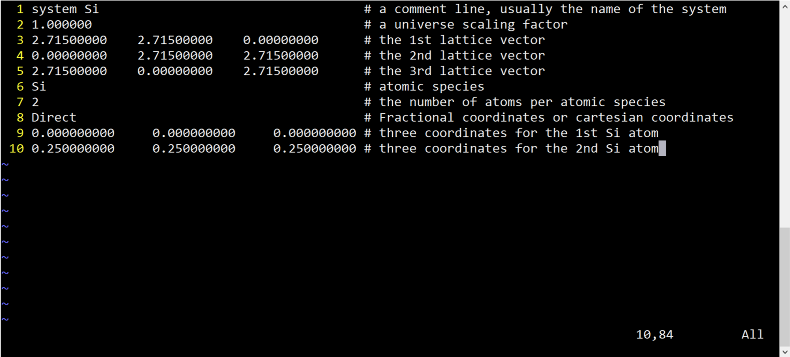

## 获取晶体结构 {.allowframebreaks}

\raggedright

[Inorganic Crystal Structure Database](https://icsd.fiz-karlsruhe.de/): 实验结构

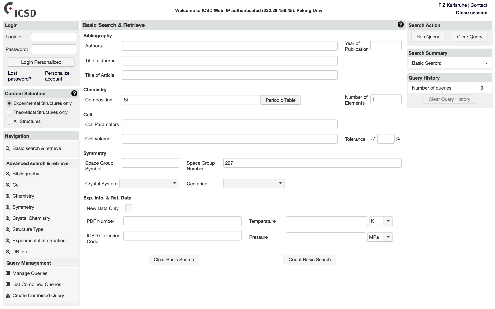{ width=70% }

\framebreak

[AFLOW](http://aflowlib.org/): Duke材料基因组学数据库

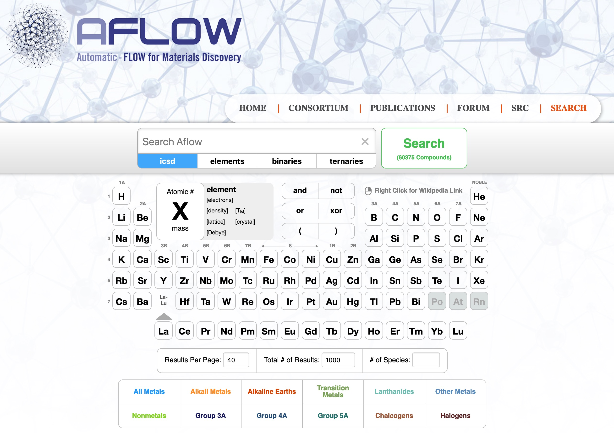{ width=60% }

\framebreak

[Materials Project](https://materialsproject.org/): 基于`pymatgen`的材料基因组学数据库

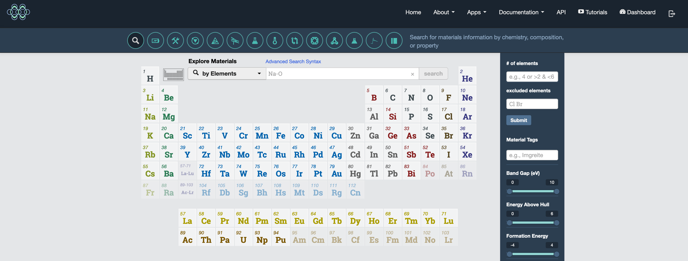{ width=80% }

## POTCAR: 原子势 {.allowframebreaks}

- `ENMAX`, `ENMIN`：平面波基组的截断能
- `LEXCH`：产生赝势所使用的泛函
- `ZVAL`：价电子数目

\framebreak

[推荐赝势](https://cms.mpi.univie.ac.at/vasp/vasp/Recommended_PAW_potentials_DFT_calculations_using_vasp_5_2.html
)

\centering
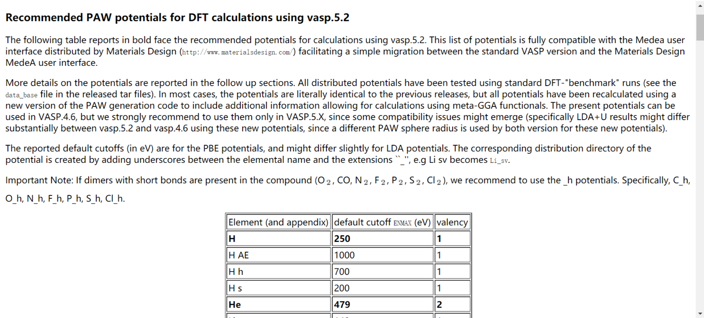

## INCAR: 计算参数控制 {.allowframebreaks}

\centering
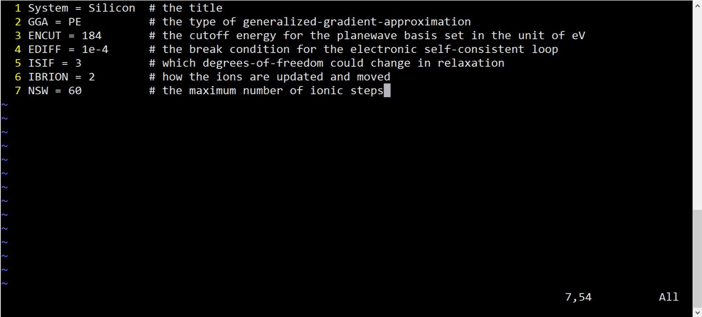

\framebreak
\raggedright

| 标签   | 作用                                      |
| :----- | :---------------------------------------- |
| ISIF   | 控制哪些自由度被优化                      |
| IBRION | 设置结构优化使用的算法                    |
| ALGO   | 设置电子步SCF迭代的算法, 也会影响结构优化 |
| NSW    | 结构优化的最大步数                        |
| EDIFF  | 电子步的收敛标准                          |
| EDIFFG | 离子步的收敛标准, 可以是能量或力          |

\framebreak

\centering
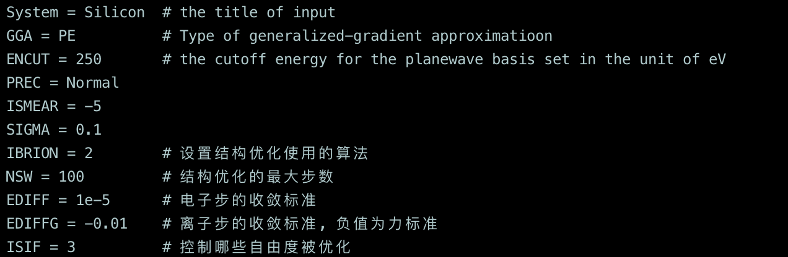

## KPOINTS: 倒空间K点取样网格

\centering
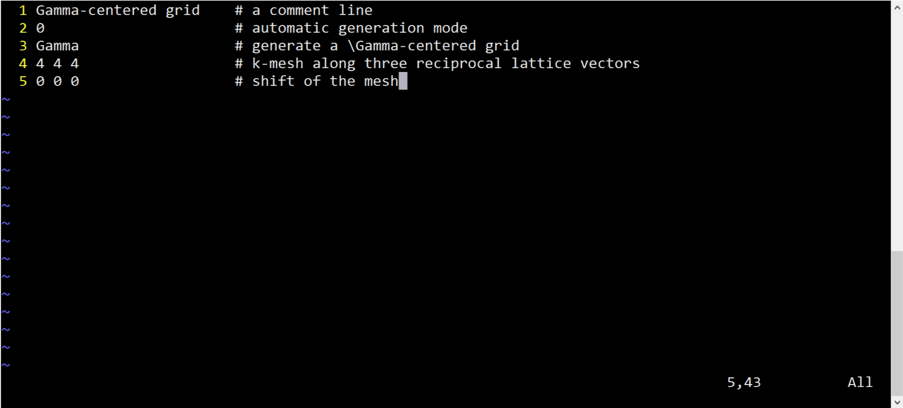

# 执行VASP计算

## 创建运算目录 {.allowframebreaks}

\raggedright

- 教学一号

    ```bash
    $ ls
    sc_run_vasp.sh POSCAR POTCAR INCAR KPOINTS
    $ mkdir session-1/
    $ cp POSCAR POTCAR INCAR KPOINTS session-1/
    $ cp sc_run_vasp.sh session-1/
    $ cd session-1/
    ```

- TMC PC

    ```bash
    $ ls
    tests Documents Downloads ...
    $ mkdir -p tests/YOUR_NAME
    $ cp POSCAR POTCAR INCAR KPOINTS tests/YOUR_NAME
    $ cd tests/YOUR_NAME
    ```

\framebreak

|  命令   | 用法             | 作用                     |
| :-----: | :--------------- | :----------------------- |
|  `ls`   | `ls [.]`         | 显示某路径下文件与文件夹 |
|  `cd`   | `cd name`        | 进入`name`文件夹         |
| `mkdir` | `mkdir name`     | 新建`name`文件夹         |
|  `cp`   | `cp file1 file2` | 复制`file1`为`file2`     |

## 运行VASP {.allowframebreaks}

与Windows桌面不同, 终端下没有程序图标供你双击

可执行程序的位置

- 当前路径
- 环境变量`PATH`中记录的路径

    ```bash
    $ echo $PATH
    /usr/bin:/bin:...
    ```

用`which`确认可执行程序位置, 以`ls`为例

```bash
$ which ls
/usr/bin/ls
```

\framebreak

确认可执行程序`vasp_std`的位置

- 教学一号

    ```bash
    $ which vasp_std
    $ module load vasp/5.4.4-intel18.0
    $ which vasp_std
    /nfs-share/software/vasp/intel18.0/bin/vasp_std
    ```

- TMC PC

    ```bash
    $ which vasp_std
    /home/dft003/software/vasp.5.4.4/bin/vasp_std
    ```

\framebreak

Q: 为什么第一次`which`的结果不同?

A: 在教学一号上

\quad

```bash
$ echo $PATH
/nfs-share/software/module/bin:/usr/local/bin:/usr/bin:...
$ module load vasp/5.4.4-intel18.0
$ echo $PATH
/nfs-share/software/vasp/intel18.0/bin/:
/nfs-share/software/module/bin:/usr/local/bin:/usr/bin:
...
```

`module`来自[Environment module](http://modules.sourceforge.net/), 一个环境变量管理工具

\framebreak

```bash
$ cat sc_run_vasp.sh
#!/usr/bin/env bash              # 解释器
#SBATCH -A 150xxxxxxx            # 学号
#SBATCH --nodes=1                # 使用一个节点
#SBATCH -c 2                     # 每个节点使用2个核心
#SBATCH --partition=compute      # 指定计算分区
#SBATCH -J test                  # 任务名
#SBATCH -o stdout

module load intel/2018.0         # 载入Intel编译器环境变量
module load vasp/5.4.4-intel18.0 # 载入VASP环境变量 (PATH)

mpirun -np 2 vasp_std            # 运行
```

\framebreak

开始计算任务, 每秒监控标准输出

- 教学一号

    ```bash
    $ sbatch sc_run_vasp.sh
    Submitted batch job xxxx
    $ watch -n 1 tail stdout
    ```

- TMC PC

    ```bash
    $ mpirun -np 2 vasp_std > out &
    $ watch -n 1 tail out
    ```

`ctrl+C`退出监控

# 解读结构优化过程

## 主要输出文件

| 文件            | 内容                                           |
| :-------------- | :--------------------------------------------- |
| `stdout`或`out` | 标准输出(文件名是自定义的)                     |
| `CONTCAR`       | 结构优化完成后的晶体结构                       |
| `OUTCAR`        | 计算过程的详细输出, 包含电子能带和原子受力信息 |
| `OSZICAR`       | 每个电子步和离子步的能量信息汇总               |

## 优化过程 {.allowframebreaks}

`reached required accuracy`: 优化收敛到要求精度

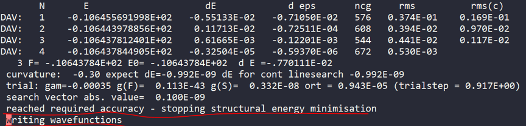

\framebreak

OSZICAR中可以看到每一个离子步的能量

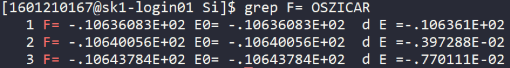

\framebreak
`ISIF=3`并且以力作为收敛标准时，vasp会检查每个原子上的受力以及external pressure，只有当二者都达到标准时才优化结束

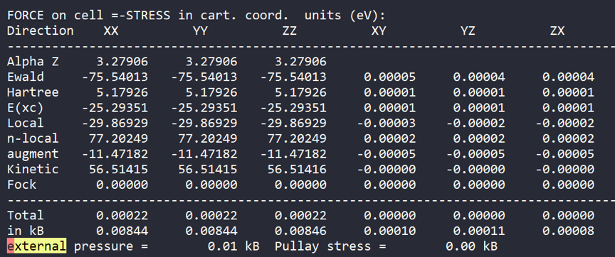

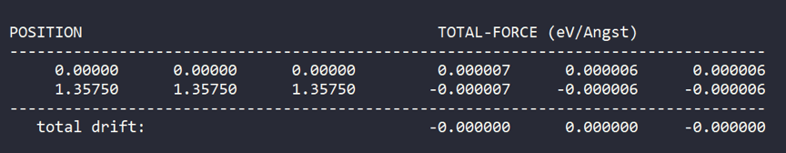
