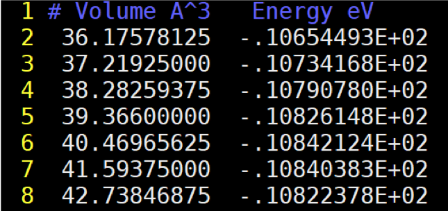
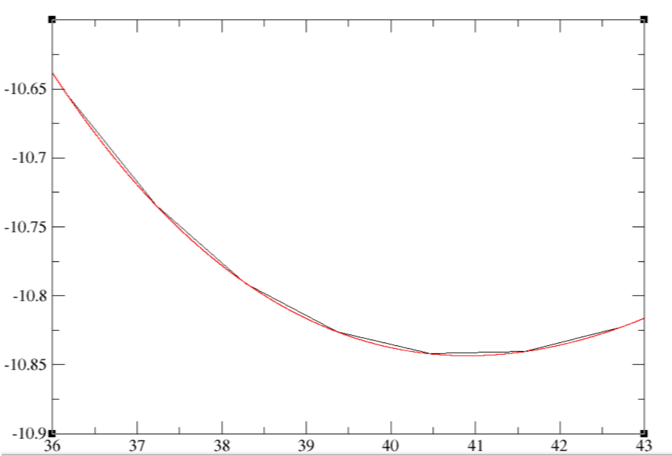
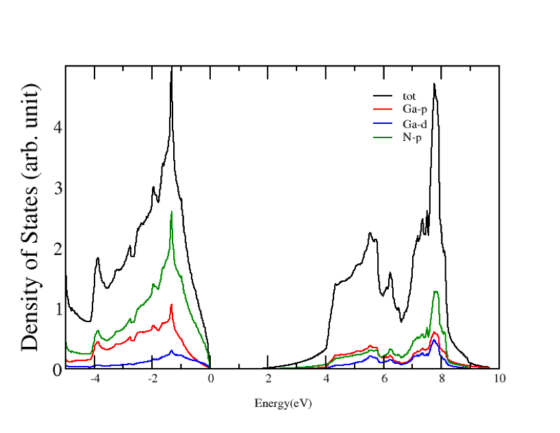

## 参考材料

XmGrace

- 官方[Tutorial](http://plasma-gate.weizmann.ac.il/Grace/doc/Tutorial.html), [UG](http://plasma-gate.weizmann.ac.il/Grace/doc/UsersGuide.html), [FAQ](http://plasma-gate.weizmann.ac.il/Grace/doc/FAQ.html)
- [XMGR - Grace Graphics Refresher Training & Reference Guide](https://www.sfwmd.gov/sites/default/files/documents/xmgr-grace.pdf)

态密度

- [GPAW PDOS](https://wiki.fysik.dtu.dk/gpaw/documentation/pdos/pdos.html#density-of-states)

# 状态方程计算

## 为什么用状态方程优化晶胞体积

状态方程 (Equation of state):

$$
E \equiv E(V)
$$

- 避免[Pulay Stress对结果的影响](https://cms.mpi.univie.ac.at/wiki/index.php/Energy_vs_volume_Volume_relaxations_and_Pulay_stress)
- 对于大体系节省计算开销, 不用担心结构收敛的问题

## 简单算例: Si

参考的脚本: [cd Si `loop.sh`](https://cms.mpi.univie.ac.at/wiki/index.php/Cd_Si)

\scriptsize

```bash
#! /bin/bash
BIN=/path/to/your/vasp/executable
rm WAVECAR SUMMARY.dia
for i in  5.1 5.2 5.3 5.4 5.5 5.6 5.7 ; do
cat >POSCAR <<!
cubic diamond
   $i
 0.0    0.5     0.5
 0.5    0.0     0.5
 0.5    0.5     0.0
  2
Direct
 -0.125 -0.125 -0.125
  0.125  0.125  0.125
!
echo "a= $i" ; mpirun -n 2 $BIN
E=`awk '/F=/ {print $0}' OSZICAR` ; echo $i $E  >>SUMMARY.dia
done
```

\normalsize

- 在ENCUT=300条件下和ISIF=3的计算结果比较
- 和ENCUT=550的ISIF=3的结果比较

## 状态方程拟合

Birch-Murnaghan equation of state ([wikipedia](https://en.wikipedia.org/wiki/Birch%E2%80%93Murnaghan_equation_of_state))

\begin{align*}
E(V) &=E_{0} + \frac{9 V_{0} B_{0}}{16}\times \\
     &\qquad\left\{\left[\left(\frac{V_{0}}{V}\right)^{\frac{2}{3}}-1\right]^{3} B_{0}^{\prime}+\left[\left(\frac{V_{0}}{V}\right)^{\frac{2}{3}}-1\right]^{2}\left[6-4\left(\frac{V_{0}}{V}\right)^{\frac{2}{3}}\right]\right\}
\end{align*}

::::::{.columns}
:::{.column width=50%}

:::
:::{.column width=50%}

:::
::::::

# 态密度计算

## 定义

给定能量范围内的态的数目

$$
D(E) = \sum_n{\delta(E-E_n)}
$$

## VASP INCAR

- `NEDOS`
- `EMIN`
- `EMAX`
- `LORBIT`
- `ISMEAR`
- `SIGMA`

## 计算流程

1. 结构优化/静态计算
2. 态密度计算
    - 固定电荷密度
    - 关闭对称性
    - 增大`NEDOS`
    - 增大k点密度

## 主要输出文件

- [DOSCAR](https://cms.mpi.univie.ac.at/wiki/index.php/DOSCAR)
- [PROCAR](https://cms.mpi.univie.ac.at/wiki/index.php/PROCAR)
- vasprun.xml

## 使用`py_dos.py`

查看帮助

```bash
py_dos.py --help
```

示例

```bash
py_dos.py -d dos -i vasp --format=%s-%l
```

\centering
{width=60%}


